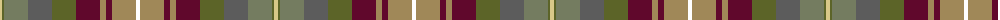

The parent of this is [Auld Scotland Weavers Tartan Tartan Number: 7303. Earliest known date: September 2007 A new design from Lochcarron for the 2008 season. See products available Copyright © Blair Urquhart, Comrie, 2015](/tartans/lg/4/ga2/g24/n24/ga24/dr24/lt6/dr6/lt24/r/4/)

This was sourced from house-of-tartan.  It is a [10 stripes tartan](/stripes/stripes10/).

Original link http://www.house-of-tartan.scotland.net/house/TartanViewjs.asp?colr=Def&tnam=7303

## Thread count
LG/4 Ga2 G24 N24 Ga24 DR24 LT6 DR6 LT24 R/4

## Palette
Each colour and its ΔE from the base-6 reference it is a variant of.

| Colour | Shade | Base | ΔE (OKLab) |
|---|---|---|---|
| DR |  `#60082C` | B  | 0.19 |
| G |  `#747C60` | G  | 0.17 |
| Ga |  `#5C6428` | G  | 0.09 |
| LG |  `#D8C888` | Y  | 0.08 |
| LGa |  `#789484` | G  | 0.23 |
| LT |  `#A08858` | Y  | 0.21 |
| N |  `#5C5C5C` | B  | 0.14 |

ID: /variants/lg/4/ga2/g24/n24/ga24/dr24/lt6/dr6/lt24/r/4-dr60082c-g747c60-ga5c6428-lgd8c888-lga789484-lta08858-n5c5c5c/
