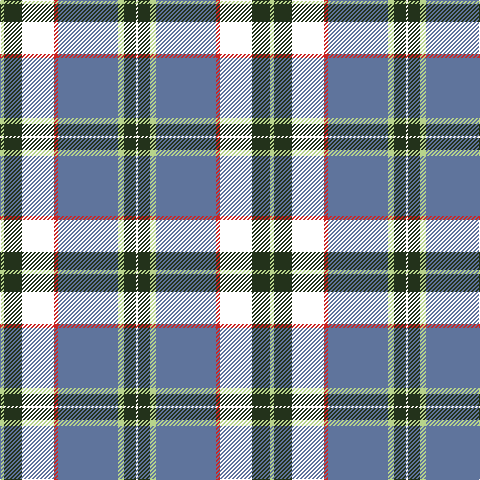

The parent of this is [Climb, The](/tartans/lg/4/k18/dr32/r4/b60/lg6/k12/w/2/)

This was sourced from register-of-tartans.  It is a [8 stripes tartan](/stripes/stripes8/).

Original link https://www.tartanregister.gov.uk/tartanDetails.aspx?ref=10807

## Thread count
LG/4 K18 DR32 R4 B60 LG6 K12 W/2

## Palette
Each colour and its ΔE from the base-6 reference it is a variant of.

| Colour | Shade | Base | ΔE (OKLab) |
|---|---|---|---|
| B |  `#5F749C` | B  | 0.17 |
| K |  `#23321B` | G  | 0.17 |
| LG |  `#B7D38B` | Y  | 0.10 |
| R |  `#CA2625` | R  | 0.03 |
| W |  `#F9F5EF` | W  | 0.01 |

# Sample pattern

ID: /variants/lg/4/k18/dr32/r4/b60/lg6/k12/w/2-b5f749c-k23321b-lgb7d38b-rca2625-wf9f5ef/
