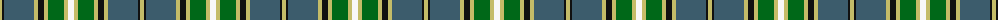

The parent of this is [MacManus](/tartans/lg/4/k2/n30/lg4/k6/lg4/g16/lg4/w/6/)

This was sourced from tartans-authority.  It is a [9 stripes tartan](/stripes/stripes9/).

Original link http://www.tartansauthority.com/tartan-ferret/display/7970/

## Thread count
LG/4 K2 N30 LG4 K6 LG4 G16 LG4 W/6

## Palette
Each colour and its ΔE from the base-6 reference it is a variant of.

| Colour | Shade | Base | ΔE (OKLab) |
|---|---|---|---|
| G |  `#006818` | G  | 0.02 |
| K |  `#101010` | K  | 0.17 |
| LG |  `#C4BC68` | Y  | 0.07 |
| N |  `#3C5C6C` | B  | 0.11 |
| W |  `#F8F8F8` | W  | 0.01 |

ID: /variants/lg/4/k2/n30/lg4/k6/lg4/g16/lg4/w/6-g006818-k101010-lgc4bc68-n3c5c6c-wf8f8f8/
