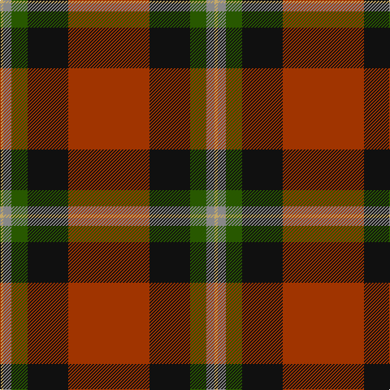

The parent of this is [MacGleish Formal (Personal)](/tartans/lg/4/n10/g20/k50/r/100/)

This was sourced from register-of-tartans.  It is a [5 stripes tartan](/stripes/stripes5/).

Original link https://www.tartanregister.gov.uk/tartanDetails.aspx?ref=10289

## Thread count
LG/4 N10 G20 K50 R/100

## Palette
Each colour and its ΔE from the base-6 reference it is a variant of.

| Colour | Shade | Base | ΔE (OKLab) |
|---|---|---|---|
| G |  `#285800` | G  | 0.04 |
| K |  `#101010` | K  | 0.17 |
| LG |  `#C4A868` | Y  | 0.11 |
| N |  `#888888` | R  | 0.24 |
| R |  `#A03400` | R  | 0.08 |

# Sample pattern

ID: /variants/lg/4/n10/g20/k50/r/100-g285800-k101010-lgc4a868-n888888-ra03400/
