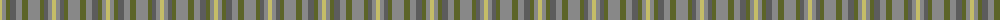

The parent of this is [Callanish (District)](/tartans/lg/4/na4/g4/n6/na6/g6/na12/g4/n4/na4/lg/4/)

This was sourced from tartans-authority.  It is a [11 stripes tartan](/stripes/stripes11/).

Original link http://www.tartansauthority.com/tartan-ferret/display/10393/

## Thread count
LG/4 Na4 G4 N6 Na6 G6 Na12 G4 N4 Na4 LG/4

## Palette
Each colour and its ΔE from the base-6 reference it is a variant of.

| Colour | Shade | Base | ΔE (OKLab) |
|---|---|---|---|
| G |  `#5C6428` | G  | 0.09 |
| LG |  `#C4BC68` | Y  | 0.07 |
| N |  `#5C5C5C` | B  | 0.14 |
| Na |  `#888888` | R  | 0.24 |

ID: /variants/lg/4/na4/g4/n6/na6/g6/na12/g4/n4/na4/lg/4-g5c6428-lgc4bc68-n5c5c5c-na888888/
