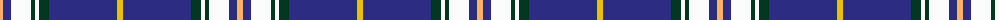
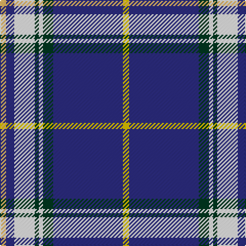

The parent of this is [Royal Troon Golf Club, The](/tartans/lg/6/db8/w20/dg4/w4/dg10/db68/y/6/)

This was sourced from tartans-authority.  It is a [8 stripes tartan](/stripes/stripes8/).

Original link http://www.tartansauthority.com/tartan-ferret/display/11094/

## Thread count
LG/6 DB8 W20 DG4 W4 DG10 DB68 Y/6

## Palette
Each colour and its ΔE from the base-6 reference it is a variant of.

| Colour | Shade | Base | ΔE (OKLab) |
|---|---|---|---|
| DB |  `#2C2C80` | B  | 0.05 |
| DG |  `#003820` | G  | 0.16 |
| LG |  `#FCB464` | Y  | 0.08 |
| W |  `#FCFCFC` | W  | 0.03 |
| Y |  `#E8C000` | Y  | 0.00 |

# Sample pattern

ID: /variants/lg/6/db8/w20/dg4/w4/dg10/db68/y/6-db2c2c80-dg003820-lgfcb464-wfcfcfc-ye8c000/
