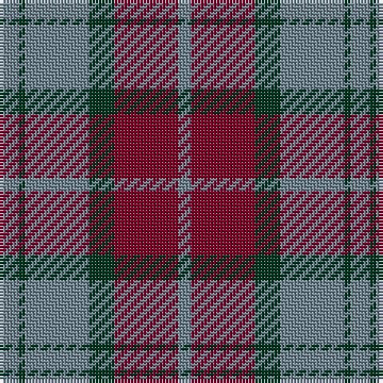

The parent of this is [Rob Roy (Film)](/tartans/lg/6/dg2/lg20/dg8/dr20/lg/4/)

This was sourced from register-of-tartans.  It is a [6 stripes tartan](/stripes/stripes6/).

Original link https://www.tartanregister.gov.uk/tartanDetails.aspx?ref=3515

## Thread count
LG/6 DG2 LG20 DG8 DR20 LG/4

## Palette
Each colour and its ΔE from the base-6 reference it is a variant of.

| Colour | Shade | Base | ΔE (OKLab) |
|---|---|---|---|
| DG |  `#003820` | G  | 0.16 |
| DR |  `#800028` | R  | 0.16 |
| LG |  `#708490` | G  | 0.22 |

# Sample pattern

ID: /variants/lg/6/dg2/lg20/dg8/dr20/lg/4-dg003820-dr800028-lg708490/
