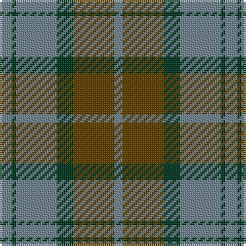

The parent of this is [Rob Roy (Film) (Corporate)](/tartans/lg/6/dg2/lg20/dg8/t20/lg/4/)

This was sourced from tartans-authority.  It is a [6 stripes tartan](/stripes/stripes6/).

Original link http://www.tartansauthority.com/tartan-ferret/display/7026/

## Thread count
LG/6 DG2 LG20 DG8 T20 LG/4

## Palette
Each colour and its ΔE from the base-6 reference it is a variant of.

| Colour | Shade | Base | ΔE (OKLab) |
|---|---|---|---|
| DG |  `#003820` | G  | 0.16 |
| LG |  `#708490` | G  | 0.22 |
| T |  `#604000` | G  | 0.14 |

# Sample pattern

ID: /variants/lg/6/dg2/lg20/dg8/t20/lg/4-dg003820-lg708490-t604000/
