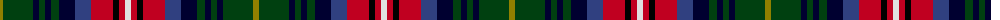

The parent of this is [Chattahoochee](/tartans/lg/6/dg30/db6/dg6/db6/dg8/db16/b16/r22/k6/r6/ln/6/)

This was sourced from weddslist.  It is a [12 stripes tartan](/stripes/stripes12/).

Original link http://www.weddslist.com/cgi-bin/tartans/pg.pl?source=sts

## Thread count
LG/6 DG30 DB6 DG6 DB6 DG8 DB16 B16 R22 K6 R6 LN/6

## Palette
Each colour and its ΔE from the base-6 reference it is a variant of.

| Colour | Shade | Base | ΔE (OKLab) |
|---|---|---|---|
| B |  `#304080` | B  | 0.01 |
| DB |  `#000030` | K  | 0.17 |
| DG |  `#004010` | G  | 0.12 |
| K |  `#000000` | K  | 0.00 |
| LG |  `#908000` | G  | 0.19 |
| LN |  `#E0E0E0` | W  | 0.06 |
| R |  `#C00020` | R  | 0.02 |

ID: /variants/lg/6/dg30/db6/dg6/db6/dg8/db16/b16/r22/k6/r6/ln/6-b304080-db000030-dg004010-k000000-lg908000-lne0e0e0-rc00020/
