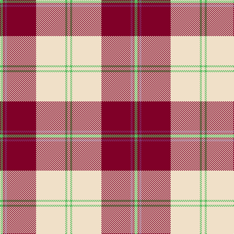

The parent of this is [Torridon, Burgundy (Dance)](/tartans/lg/6/dr4/p4/dr60/w60/lg4/w/6/)

This was sourced from tartans-authority.  It is a [7 stripes tartan](/stripes/stripes7/).

Original link http://www.tartansauthority.com/tartan-ferret/display/7607/

## Thread count
LG/6 DR4 P4 DR60 W60 LG4 W/6

## Palette
Each colour and its ΔE from the base-6 reference it is a variant of.

| Colour | Shade | Base | ΔE (OKLab) |
|---|---|---|---|
| DR |  `#800028` | R  | 0.16 |
| LG |  `#58BC60` | Y  | 0.18 |
| P |  `#843470` | B  | 0.16 |
| W |  `#F0E0C8` | W  | 0.06 |

# Sample pattern

ID: /variants/lg/6/dr4/p4/dr60/w60/lg4/w/6-dr800028-lg58bc60-p843470-wf0e0c8/
