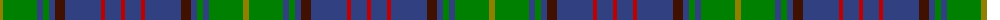

The parent of this is [Donegal](/tartans/lg/6/g34/b6/g6/b6/dr10/b36/r4/b16/r/4/)

This was sourced from weddslist.  It is a [10 stripes tartan](/stripes/stripes10/).

Original link http://www.weddslist.com/cgi-bin/tartans/pg.pl?source=sts

## Thread count
LG/6 G34 B6 G6 B6 DR10 B36 R4 B16 R/4

## Palette
Each colour and its ΔE from the base-6 reference it is a variant of.

| Colour | Shade | Base | ΔE (OKLab) |
|---|---|---|---|
| B |  `#304080` | B  | 0.01 |
| DR |  `#401000` | B  | 0.23 |
| G |  `#008000` | G  | 0.09 |
| LG |  `#908000` | G  | 0.19 |
| R |  `#C00000` | R  | 0.02 |

ID: /variants/lg/6/g34/b6/g6/b6/dr10/b36/r4/b16/r/4-b304080-dr401000-g008000-lg908000-rc00000/
