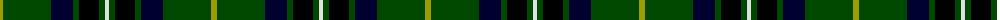

The parent of this is [Cornish Brewery, Green](/tartans/lg/6/g48/db22/g6/k20/g6/ln/4/)

This was sourced from register-of-tartans.  It is a [7 stripes tartan](/stripes/stripes7/).

Original link https://www.tartanregister.gov.uk/tartanDetails.aspx?ref=761

## Thread count
LG/6 G48 DB22 G6 K20 G6 LN/4

## Palette
Each colour and its ΔE from the base-6 reference it is a variant of.

| Colour | Shade | Base | ΔE (OKLab) |
|---|---|---|---|
| DB |  `#000030` | K  | 0.17 |
| G |  `#004800` | G  | 0.09 |
| K |  `#000000` | K  | 0.00 |
| LG |  `#9C9C00` | Y  | 0.16 |
| LN |  `#E0E0E0` | W  | 0.06 |

# Sample pattern

ID: /variants/lg/6/g48/db22/g6/k20/g6/ln/4-db000030-g004800-k000000-lg9c9c00-lne0e0e0/
