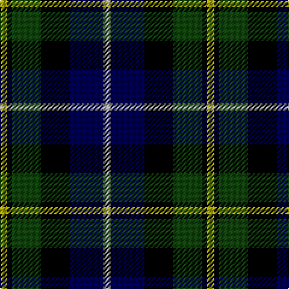

The parent of this is [MacNiel of Barra](/tartans/lg/6/k4/dg24/k24/db28/n/6/)

This was sourced from weddslist.  It is a [6 stripes tartan](/stripes/stripes6/).

Original link http://www.weddslist.com/cgi-bin/tartans/pg.pl?source=tinsel

## Thread count
LG/6 K4 DG24 K24 DB28 N/6

## Palette
Each colour and its ΔE from the base-6 reference it is a variant of.

| Colour | Shade | Base | ΔE (OKLab) |
|---|---|---|---|
| DB |  `#000052` | B  | 0.20 |
| DG |  `#11450D` | G  | 0.10 |
| K |  `#000000` | K  | 0.00 |
| LG |  `#AAAA00` | Y  | 0.11 |
| N |  `#AAAAAA` | Y  | 0.19 |

# Sample pattern

ID: /variants/lg/6/k4/dg24/k24/db28/n/6-db000052-dg11450d-k000000-lgaaaa00-naaaaaa/
