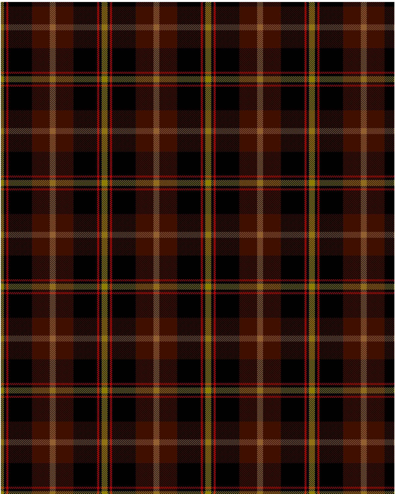

The parent of this is [Drambuie hunting](/tartans/lg/6/k5/r4/k48/dr36/lt/6/)

This was sourced from <no value>.  It is a [6 stripes tartan](/stripes/stripes6/).

Original link http://www.weddslist.com/cgi-bin/tartans/pg.pl?source=sts

## Thread count
LG/6 K5 R4 K48 DR36 LT/6

## Palette
DR K LG LT R

# Sample pattern

ID: /variants/lg/6/k5/r4/k48/dr36/lt/6-dr401000-k000000-lg908000-lt906030-rc00000/