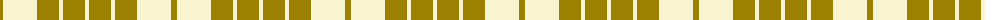
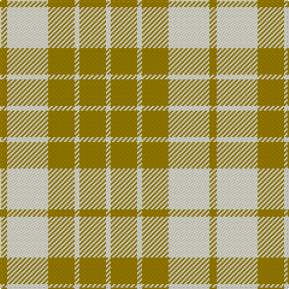

The parent of this is [Fallow Deer (Fashion)](/tartans/lg/6/ly34/lg22/ly4/lg22/ly/4/)

This was sourced from tartans-authority.  It is a [6 stripes tartan](/stripes/stripes6/).

Original link http://www.tartansauthority.com/tartan-ferret/display/4835/

## Thread count
LG/6 LY34 LG22 LY4 LG22 LY/4

## Palette
Each colour and its ΔE from the base-6 reference it is a variant of.

| Colour | Shade | Base | ΔE (OKLab) |
|---|---|---|---|
| LG |  `#9C8000` | G  | 0.21 |
| LY |  `#F8F4D0` | W  | 0.04 |

# Sample pattern

ID: /variants/lg/6/ly34/lg22/ly4/lg22/ly/4-lg9c8000-lyf8f4d0/
