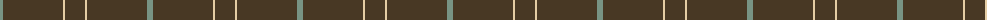
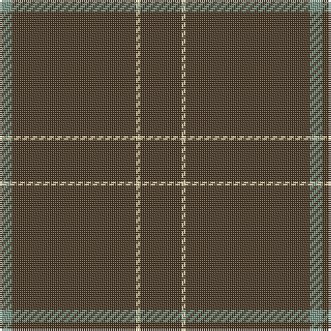

The parent of this is [Pasteur](/tartans/lg/6/t60/lr2/t/20/)

This was sourced from register-of-tartans.  It is a [4 stripes tartan](/stripes/stripes4/).

Original link https://www.tartanregister.gov.uk/tartanDetails.aspx?ref=3299

## Thread count
LG/6 T60 LR2 T/20

## Palette
Each colour and its ΔE from the base-6 reference it is a variant of.

| Colour | Shade | Base | ΔE (OKLab) |
|---|---|---|---|
| LG |  `#789484` | G  | 0.23 |
| LR |  `#E4CCA4` | Y  | 0.12 |
| T |  `#483824` | B  | 0.16 |

# Sample pattern

ID: /variants/lg/6/t60/lr2/t/20-lg789484-lre4cca4-t483824/
