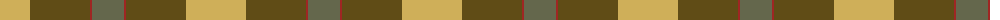

The parent of this is [Barber Family 2011 (Personal)](/tartans/lg/60/t60/dr2/n/32/)

This was sourced from register-of-tartans.  It is a [4 stripes tartan](/stripes/stripes4/).

Original link https://www.tartanregister.gov.uk/tartanDetails.aspx?ref=10535

## Thread count
LG/60 T60 DR2 N/32

## Palette
Each colour and its ΔE from the base-6 reference it is a variant of.

| Colour | Shade | Base | ΔE (OKLab) |
|---|---|---|---|
| DR |  `#9F2623` | R  | 0.08 |
| LG |  `#CFAF59` | Y  | 0.08 |
| N |  `#64674C` | G  | 0.13 |
| T |  `#604C16` | G  | 0.12 |

# Sample pattern

ID: /variants/lg/60/t60/dr2/n/32-dr9f2623-lgcfaf59-n64674c-t604c16/
