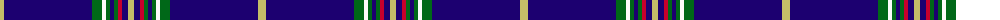

The parent of this is [Oxford University Dress (Corporate)](/tartans/lg/8/db88/g10/w4/g4/db4/g4/r4/db6/lg/6/)

This was sourced from tartans-authority.  It is a [10 stripes tartan](/stripes/stripes10/).

Original link http://www.tartansauthority.com/tartan-ferret/display/2653/

## Thread count
LG/8 DB88 G10 W4 G4 DB4 G4 R4 DB6 LG/6

## Palette
Each colour and its ΔE from the base-6 reference it is a variant of.

| Colour | Shade | Base | ΔE (OKLab) |
|---|---|---|---|
| DB |  `#1C0070` | B  | 0.14 |
| G |  `#006818` | G  | 0.02 |
| LG |  `#C4BC68` | Y  | 0.07 |
| R |  `#C8002C` | R  | 0.03 |
| W |  `#FCFCFC` | W  | 0.03 |

ID: /variants/lg/8/db88/g10/w4/g4/db4/g4/r4/db6/lg/6-db1c0070-g006818-lgc4bc68-rc8002c-wfcfcfc/
