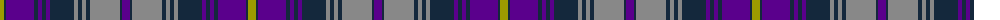

The parent of this is [Scottish-Shop Switzerland](/tartans/lg/8/dn2/p28/dn4/p4/dn4/p4/dn24/n4/dn4/n4/dn4/n30/dn2/p/8/)

This was sourced from register-of-tartans.  It is a [15 stripes tartan](/stripes/stripes15/).

Original link https://www.tartanregister.gov.uk/tartanDetails.aspx?ref=11630

## Thread count
LG/8 DN2 P28 DN4 P4 DN4 P4 DN24 N4 DN4 N4 DN4 N30 DN2 P/8

## Palette
Each colour and its ΔE from the base-6 reference it is a variant of.

| Colour | Shade | Base | ΔE (OKLab) |
|---|---|---|---|
| DN |  `#14283C` | B  | 0.14 |
| LG |  `#9C9C00` | Y  | 0.16 |
| N |  `#888888` | R  | 0.24 |
| P |  `#5A008C` | B  | 0.12 |

ID: /variants/lg/8/dn2/p28/dn4/p4/dn4/p4/dn24/n4/dn4/n4/dn4/n30/dn2/p/8-dn14283c-lg9c9c00-n888888-p5a008c/
