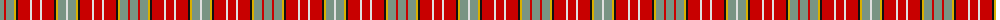

The parent of this is [Ogilvie (D.C. Stewart)](/tartans/lg/8/r2/lg8/y2/k2/r12/ln2/r8/ln2/r12/k2/y2/lg8/ln/2/)

This was sourced from register-of-tartans.  It is a [14 stripes tartan](/stripes/stripes14/).

Original link https://www.tartanregister.gov.uk/tartanDetails.aspx?ref=3226

## Thread count
LG/8 R2 LG8 Y2 K2 R12 LN2 R8 LN2 R12 K2 Y2 LG8 LN/2

## Palette
Each colour and its ΔE from the base-6 reference it is a variant of.

| Colour | Shade | Base | ΔE (OKLab) |
|---|---|---|---|
| DP |  `#440044` | B  | 0.17 |
| K |  `#101010` | K  | 0.17 |
| LG |  `#789484` | G  | 0.23 |
| LN |  `#E0E0E0` | W  | 0.06 |
| R |  `#C80000` | R  | 0.00 |
| W |  `#FCFCFC` | W  | 0.03 |
| Y |  `#D8B000` | Y  | 0.05 |

ID: /variants/lg/8/r2/lg8/y2/k2/r12/ln2/r8/ln2/r12/k2/y2/lg8/ln/2-dp440044-k101010-lg789484-lne0e0e0-rc80000-wfcfcfc-yd8b000/
