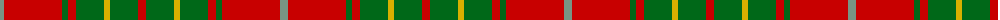

The parent of this is [Burnett (Name)](/tartans/lg/8/r58/g6/r8/g28/y6/g28/r/8/)

This was sourced from tartans-authority.  It is a [8 stripes tartan](/stripes/stripes8/).

Original link http://www.tartansauthority.com/tartan-ferret/display/2355/

## Thread count
LG/8 R58 G6 R8 G28 Y6 G28 R/8

## Palette
Each colour and its ΔE from the base-6 reference it is a variant of.

| Colour | Shade | Base | ΔE (OKLab) |
|---|---|---|---|
| G |  `#006818` | G  | 0.02 |
| LG |  `#789484` | G  | 0.23 |
| R |  `#C80000` | R  | 0.00 |
| Y |  `#D8B000` | Y  | 0.05 |

# Sample pattern

ID: /variants/lg/8/r58/g6/r8/g28/y6/g28/r/8-g006818-lg789484-rc80000-yd8b000/
