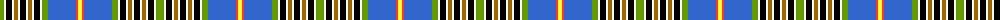

The parent of this is [City Of Dorval](/tartans/lg/8/w2/k6/w2/do4/w2/k6/w2/do4/w2/k6/w2/lg6/b28/r2/y/4/)

This was sourced from register-of-tartans.  It is a [16 stripes tartan](/stripes/stripes16/).

Original link https://www.tartanregister.gov.uk/tartanDetails.aspx?ref=10090

## Thread count
LG/8 W2 K6 W2 DO4 W2 K6 W2 DO4 W2 K6 W2 LG6 B28 R2 Y/4

## Palette
Each colour and its ΔE from the base-6 reference it is a variant of.

| Colour | Shade | Base | ΔE (OKLab) |
|---|---|---|---|
| B |  `#3366CC` | B  | 0.15 |
| DO |  `#996600` | R  | 0.16 |
| K |  `#000000` | K  | 0.00 |
| LG |  `#669900` | G  | 0.19 |
| R |  `#FF3333` | R  | 0.13 |
| W |  `#FFFAFA` | W  | 0.02 |
| Y |  `#FFFF33` | Y  | 0.16 |

ID: /variants/lg/8/w2/k6/w2/do4/w2/k6/w2/do4/w2/k6/w2/lg6/b28/r2/y/4-b3366cc-do996600-k000000-lg669900-rff3333-wfffafa-yffff33/
