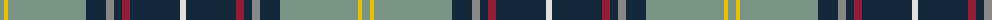

The parent of this is [Blue Blas Alba (Fashion)](/tartans/lg/8/y4/lg78/dn20/n8/dn8/dr8/dn50/ln/6/)

This was sourced from tartans-authority.  It is a [9 stripes tartan](/stripes/stripes9/).

Original link http://www.tartansauthority.com/tartan-ferret/display/6892/

## Thread count
LG/8 Y4 LG78 DN20 N8 DN8 DR8 DN50 LN/6

## Palette
Each colour and its ΔE from the base-6 reference it is a variant of.

| Colour | Shade | Base | ΔE (OKLab) |
|---|---|---|---|
| DN |  `#14283C` | B  | 0.14 |
| DR |  `#901C38` | R  | 0.12 |
| LG |  `#789484` | G  | 0.23 |
| LN |  `#E0E0E0` | W  | 0.06 |
| N |  `#888888` | R  | 0.24 |
| Y |  `#E8C000` | Y  | 0.00 |

ID: /variants/lg/8/y4/lg78/dn20/n8/dn8/dr8/dn50/ln/6-dn14283c-dr901c38-lg789484-lne0e0e0-n888888-ye8c000/
