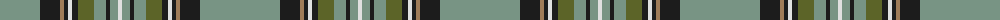

The parent of this is [Cavalier, Blue (Fashion)](/tartans/lg/80/k20/lt4/k4/ln4/k6/g16/lg12/k4/lg8/ln/4/)

This was sourced from tartans-authority.  It is a [11 stripes tartan](/stripes/stripes11/).

Original link http://www.tartansauthority.com/tartan-ferret/display/4480/

## Thread count
LG/80 K20 LT4 K4 LN4 K6 G16 LG12 K4 LG8 LN/4

## Palette
Each colour and its ΔE from the base-6 reference it is a variant of.

| Colour | Shade | Base | ΔE (OKLab) |
|---|---|---|---|
| G |  `#5C6428` | G  | 0.09 |
| K |  `#1C1C1C` | B  | 0.20 |
| LG |  `#789484` | G  | 0.23 |
| LN |  `#E0E0E0` | W  | 0.06 |
| LT |  `#A07C58` | R  | 0.19 |

ID: /variants/lg/80/k20/lt4/k4/ln4/k6/g16/lg12/k4/lg8/ln/4-g5c6428-k1c1c1c-lg789484-lne0e0e0-lta07c58/
