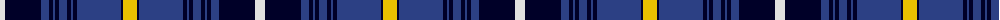

The parent of this is [Swedish](/tartans/ln/10/db36/b8/db4/b2/db4/b8/db4/b2/db4/b44/db2/y/14/)

This was sourced from register-of-tartans.  It is a [13 stripes tartan](/stripes/stripes13/).

Original link https://www.tartanregister.gov.uk/tartanDetails.aspx?ref=5959

## Thread count
LN/10 DB36 B8 DB4 B2 DB4 B8 DB4 B2 DB4 B44 DB2 Y/14

## Palette
Each colour and its ΔE from the base-6 reference it is a variant of.

| Colour | Shade | Base | ΔE (OKLab) |
|---|---|---|---|
| B |  `#2C4084` | B  | 0.00 |
| DB |  `#000028` | K  | 0.15 |
| LN |  `#E0E0E0` | W  | 0.06 |
| Y |  `#E8C000` | Y  | 0.00 |

ID: /variants/ln/10/db36/b8/db4/b2/db4/b8/db4/b2/db4/b44/db2/y/14-b2c4084-db000028-lne0e0e0-ye8c000/
