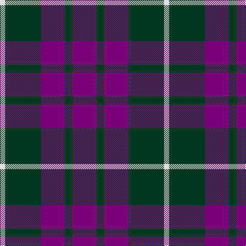

The parent of this is [Baru (Fashion)](/tartans/ln/10/dg70/p46/dg16/p/46/)

This was sourced from tartans-authority.  It is a [5 stripes tartan](/stripes/stripes5/).

Original link http://www.tartansauthority.com/tartan-ferret/display/6005/

## Thread count
LN/10 DG70 P46 DG16 P/46

## Palette
Each colour and its ΔE from the base-6 reference it is a variant of.

| Colour | Shade | Base | ΔE (OKLab) |
|---|---|---|---|
| DG |  `#003820` | G  | 0.16 |
| LN |  `#E0E0E0` | W  | 0.06 |
| P |  `#780078` | B  | 0.16 |

# Sample pattern

ID: /variants/ln/10/dg70/p46/dg16/p/46-dg003820-lne0e0e0-p780078/
