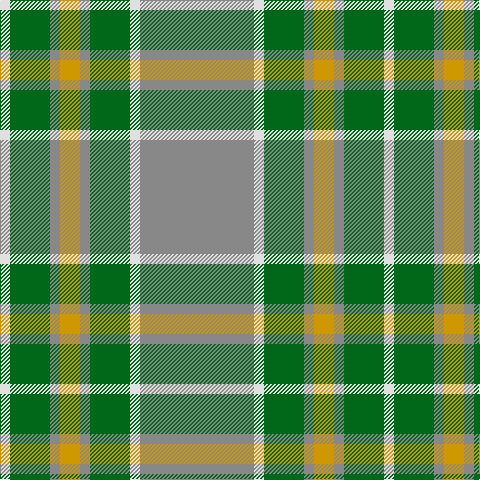

The parent of this is [Johore](/tartans/ln/10/g40/n10/dy20/n10/g40/ln10/n/114/)

This was sourced from register-of-tartans.  It is a [8 stripes tartan](/stripes/stripes8/).

Original link https://www.tartanregister.gov.uk/tartanDetails.aspx?ref=1902

## Thread count
LN/10 G40 N10 DY20 N10 G40 LN10 N/114

## Palette
Each colour and its ΔE from the base-6 reference it is a variant of.

| Colour | Shade | Base | ΔE (OKLab) |
|---|---|---|---|
| DY |  `#D09800` | Y  | 0.11 |
| G |  `#006818` | G  | 0.02 |
| LN |  `#E0E0E0` | W  | 0.06 |
| N |  `#888888` | R  | 0.24 |
| Na |  `#C0C0C0` | W  | 0.16 |
| T |  `#4C3428` | B  | 0.16 |

# Sample pattern

ID: /variants/ln/10/g40/n10/dy20/n10/g40/ln10/n/114-dyd09800-g006818-lne0e0e0-n888888-nac0c0c0-t4c3428/
