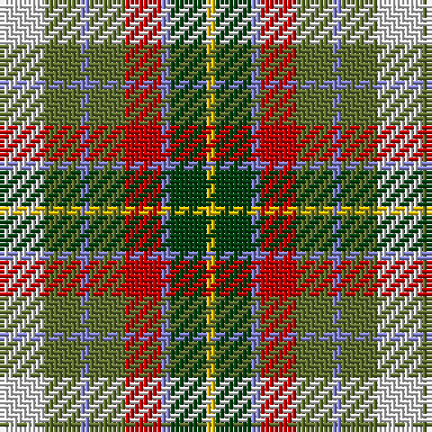

The parent of this is [Devon Rural Skills Trust](/tartans/ln/10/g8/b2/g8/r8/b2/dg8/y/2/)

This was sourced from weddslist.  It is a [8 stripes tartan](/stripes/stripes8/).

Original link http://www.weddslist.com/cgi-bin/tartans/pg.pl?source=sts

## Thread count
LN/10 G8 B2 G8 R8 B2 DG8 Y/2

## Palette
Each colour and its ΔE from the base-6 reference it is a variant of.

| Colour | Shade | Base | ΔE (OKLab) |
|---|---|---|---|
| B |  `#8080D0` | B  | 0.24 |
| DG |  `#004010` | G  | 0.12 |
| G |  `#607030` | G  | 0.11 |
| LN |  `#E0E0E0` | W  | 0.06 |
| R |  `#C00000` | R  | 0.02 |
| Y |  `#F0C000` | Y  | 0.01 |

# Sample pattern

ID: /variants/ln/10/g8/b2/g8/r8/b2/dg8/y/2-b8080d0-dg004010-g607030-lne0e0e0-rc00000-yf0c000/
