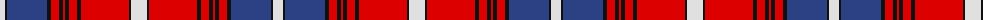

The parent of this is [Danish](/tartans/ln/10/k2/b40/k4/r8/k4/r2/k4/r8/k4/r48/k2/ln/16/)

This was sourced from register-of-tartans.  It is a [13 stripes tartan](/stripes/stripes13/).

Original link https://www.tartanregister.gov.uk/tartanDetails.aspx?ref=5956

## Thread count
LN/10 K2 B40 K4 R8 K4 R2 K4 R8 K4 R48 K2 LN/16

## Palette
Each colour and its ΔE from the base-6 reference it is a variant of.

| Colour | Shade | Base | ΔE (OKLab) |
|---|---|---|---|
| B |  `#2C4084` | B  | 0.00 |
| K |  `#101010` | K  | 0.17 |
| LN |  `#E0E0E0` | W  | 0.06 |
| R |  `#DC0000` | R  | 0.04 |

ID: /variants/ln/10/k2/b40/k4/r8/k4/r2/k4/r8/k4/r48/k2/ln/16-b2c4084-k101010-lne0e0e0-rdc0000/
