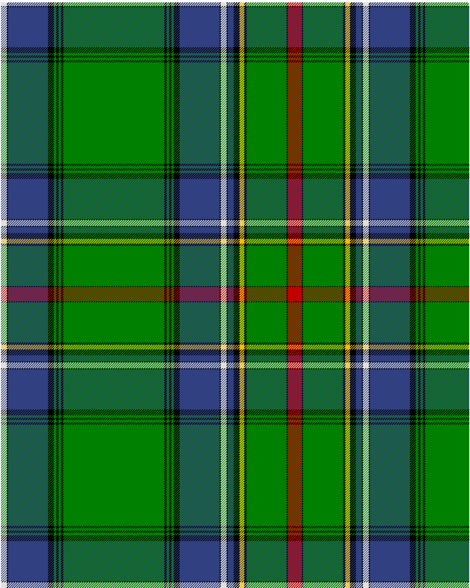

Cockburn, Old pattern

This was sourced from <no value>.  It is a 25 stripes tartan.

Original link http://www.weddslist.com/cgi-bin/tartans/pg.pl?source=sts

## Thread count
LN/10 K2 B68 K10 G4 K4 G4 K4 G172 K4 G4 K4 G4 K10 B68 K2 LN10 K2 B10 K10 Y8 K4 G68 K2 R/12

## Palette
B#304080 G#008000 K#000000 LN#E0E0E0 R#C00000 Y#F0C000

# Sample pattern

ID: /variants/ln/10/k2/b68/k10/g4/k4/g4/k4/g172/k4/g4/k4/g4/k10/b68/k2/ln10/k2/b10/k10/y8/k4/g68/k2/r/12-b304080-g008000-k000000-lne0e0e0-rc00000-yf0c000