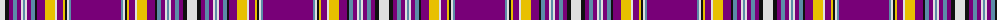

The parent of this is [Lions Canadian Tartan Tartan Number: 93. Earliest known date: pre 2003 This is the official Canadian General File thread count. The Scottish Tartans Society cloth archive specimen differs slightly in the precise numbers of threads used to weave the sample. See products available Copyright © Blair Urquhart, Comrie, 2015](/tartans/ln/10/k4/p4/b4/p4/ln2/b2/ln2/p4/b4/k2/p8/y10/ln2/p6/y2/k2/ln2/b2/p/50/)

This was sourced from house-of-tartan.  It is a [20 stripes tartan](/stripes/stripes20/).

Original link http://www.house-of-tartan.scotland.net/house/TartanViewjs.asp?colr=Def&tnam=93

## Thread count
LN/10 K4 P4 B4 P4 LN2 B2 LN2 P4 B4 K2 P8 Y10 LN2 P6 Y2 K2 LN2 B2 P/50

## Palette
Each colour and its ΔE from the base-6 reference it is a variant of.

| Colour | Shade | Base | ΔE (OKLab) |
|---|---|---|---|
| B |  `#5C8CA8` | B  | 0.23 |
| K |  `#101010` | K  | 0.17 |
| LN |  `#E0E0E0` | W  | 0.06 |
| P |  `#780078` | B  | 0.16 |
| Y |  `#E8C000` | Y  | 0.00 |

ID: /variants/ln/10/k4/p4/b4/p4/ln2/b2/ln2/p4/b4/k2/p8/y10/ln2/p6/y2/k2/ln2/b2/p/50-b5c8ca8-k101010-lne0e0e0-p780078-ye8c000/
