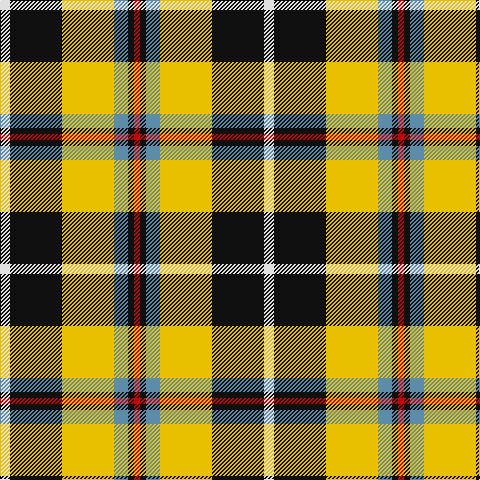

The parent of this is [Cornish National District Tartan Tartan Number: 1567. Earliest known date: 1963 The ancient kingdom of Cornwall is remembered in this tartan, designed by the Cornish poet, E.E. Morton-Nance. He regarded tartan as the "heritage of all Celts" and extold brave Cornishmen to wear the kilt of black and saffron, "Tints blazoned by her ancient Kings". There is also a Cornish Hunting tartan of more recent origin based on this sett. See products available Copyright © Blair Urquhart, Comrie, 2015](/tartans/ln/10/k52/y52/b14/k6/r/6/)

This was sourced from house-of-tartan.  It is a [6 stripes tartan](/stripes/stripes6/).

Original link http://www.house-of-tartan.scotland.net/house/TartanViewjs.asp?colr=Def&tnam=1567

## Thread count
LN/10 K52 Y52 B14 K6 R/6

## Palette
Each colour and its ΔE from the base-6 reference it is a variant of.

| Colour | Shade | Base | ΔE (OKLab) |
|---|---|---|---|
| B |  `#5C8CA8` | B  | 0.23 |
| K |  `#101010` | K  | 0.17 |
| LN |  `#E0E0E0` | W  | 0.06 |
| R |  `#C80000` | R  | 0.00 |
| Y |  `#E8C000` | Y  | 0.00 |

# Sample pattern

ID: /variants/ln/10/k52/y52/b14/k6/r/6-b5c8ca8-k101010-lne0e0e0-rc80000-ye8c000/
