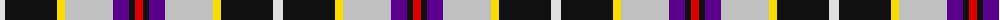

The parent of this is [Pengelly, The Cornish](/tartans/ln/10/k52/y8/n48/p16/k6/r/8/)

This was sourced from register-of-tartans.  It is a [7 stripes tartan](/stripes/stripes7/).

Original link https://www.tartanregister.gov.uk/tartanDetails.aspx?ref=5942

## Thread count
LN/10 K52 Y8 N48 P16 K6 R/8

## Palette
Each colour and its ΔE from the base-6 reference it is a variant of.

| Colour | Shade | Base | ΔE (OKLab) |
|---|---|---|---|
| K |  `#101010` | K  | 0.17 |
| LN |  `#E0E0E0` | W  | 0.06 |
| N |  `#C0C0C0` | W  | 0.16 |
| P |  `#5A008C` | B  | 0.12 |
| R |  `#DC0000` | R  | 0.04 |
| Y |  `#FADC00` | Y  | 0.08 |

# Sample pattern

ID: /variants/ln/10/k52/y8/n48/p16/k6/r/8-k101010-lne0e0e0-nc0c0c0-p5a008c-rdc0000-yfadc00/
