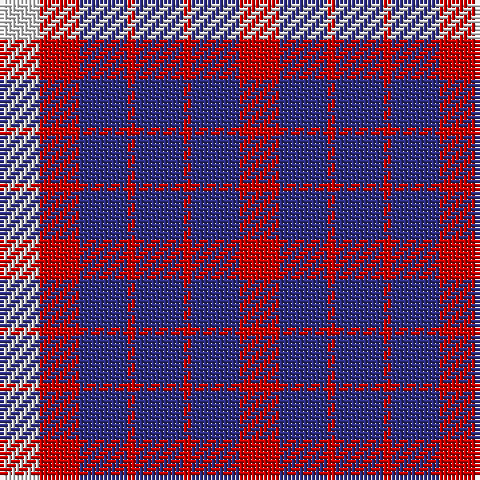

The parent of this is [U.S. Coast Guard](/tartans/ln/10/r10/db12/r2/db12/r2/db12/r/10/)

This was sourced from register-of-tartans.  It is a [8 stripes tartan](/stripes/stripes8/).

Original link https://www.tartanregister.gov.uk/tartanDetails.aspx?ref=4184

## Thread count
LN/10 R10 DB12 R2 DB12 R2 DB12 R/10

## Palette
Each colour and its ΔE from the base-6 reference it is a variant of.

| Colour | Shade | Base | ΔE (OKLab) |
|---|---|---|---|
| DB |  `#2C2C80` | B  | 0.05 |
| LN |  `#E0E0E0` | W  | 0.06 |
| R |  `#C80000` | R  | 0.00 |

# Sample pattern

ID: /variants/ln/10/r10/db12/r2/db12/r2/db12/r/10-db2c2c80-lne0e0e0-rc80000/
