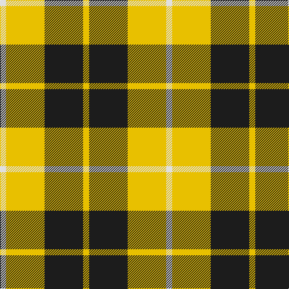

The parent of this is [Barclay Dress](/tartans/ln/10/y64/k64/y/10/)

This was sourced from register-of-tartans.  It is a [4 stripes tartan](/stripes/stripes4/).

Original link https://www.tartanregister.gov.uk/tartanDetails.aspx?ref=214

## Thread count
LN/10 Y64 K64 Y/10

## Palette
Each colour and its ΔE from the base-6 reference it is a variant of.

| Colour | Shade | Base | ΔE (OKLab) |
|---|---|---|---|
| DY |  `#BC8C00` | Y  | 0.16 |
| K |  `#1C1C1C` | B  | 0.20 |
| LN |  `#E0E0E0` | W  | 0.06 |
| Y |  `#E8C000` | Y  | 0.00 |

# Sample pattern

ID: /variants/ln/10/y64/k64/y/10-dybc8c00-k1c1c1c-lne0e0e0-ye8c000/
