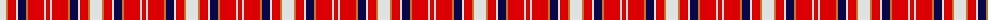

The parent of this is [Unidentified #41](/tartans/ln/12/do2/r8/ln2/db8/do2/r16/ln2/r/4/)

This was sourced from register-of-tartans.  It is a [9 stripes tartan](/stripes/stripes9/).

Original link https://www.tartanregister.gov.uk/tartanDetails.aspx?ref=4242

## Thread count
LN/12 DO2 R8 LN2 DB8 DO2 R16 LN2 R/4

## Palette
Each colour and its ΔE from the base-6 reference it is a variant of.

| Colour | Shade | Base | ΔE (OKLab) |
|---|---|---|---|
| DB |  `#080848` | B  | 0.19 |
| DO |  `#BE7832` | R  | 0.17 |
| LN |  `#E0E0E0` | W  | 0.06 |
| R |  `#DC0000` | R  | 0.04 |

ID: /variants/ln/12/do2/r8/ln2/db8/do2/r16/ln2/r/4-db080848-dobe7832-lne0e0e0-rdc0000/
