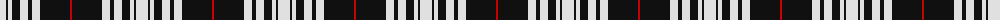

The parent of this is [Menzies Dress Tartan Tartan Number: 12444. Earliest known date: See products available Copyright © Blair Urquhart, Comrie, 2015](/tartans/ln/12/k2/ln4/k8/ln8/k4/ln8/k30/r/2/)

This was sourced from house-of-tartan.  It is a [9 stripes tartan](/stripes/stripes9/).

Original link http://www.house-of-tartan.scotland.net/house/TartanViewjs.asp?colr=Def&tnam=12444

## Thread count
LN/12 K2 LN4 K8 LN8 K4 LN8 K30 R/2

## Palette
Each colour and its ΔE from the base-6 reference it is a variant of.

| Colour | Shade | Base | ΔE (OKLab) |
|---|---|---|---|
| K |  `#101010` | K  | 0.17 |
| LN |  `#E0E0E0` | W  | 0.06 |
| R |  `#C80000` | R  | 0.00 |

ID: /variants/ln/12/k2/ln4/k8/ln8/k4/ln8/k30/r/2-k101010-lne0e0e0-rc80000/
