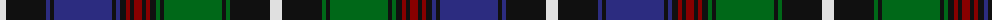

The parent of this is [Genet of An Gwylvos (Name)](/tartans/ln/12/k40/db4/k4/db58/k4/db4/k6/dr4/k4/dr8/k4/dr4/k6/g4/k4/g58/k4/g4/k40/ln/12/)

This was sourced from tartans-authority.  It is a [21 stripes tartan](/stripes/stripes21/).

Original link http://www.tartansauthority.com/tartan-ferret/display/10318/

## Thread count
LN/12 K40 DB4 K4 DB58 K4 DB4 K6 DR4 K4 DR8 K4 DR4 K6 G4 K4 G58 K4 G4 K40 LN/12

## Palette
Each colour and its ΔE from the base-6 reference it is a variant of.

| Colour | Shade | Base | ΔE (OKLab) |
|---|---|---|---|
| DB |  `#2C2C80` | B  | 0.05 |
| DR |  `#880000` | R  | 0.14 |
| G |  `#006818` | G  | 0.02 |
| K |  `#101010` | K  | 0.17 |
| LN |  `#E0E0E0` | W  | 0.06 |

ID: /variants/ln/12/k40/db4/k4/db58/k4/db4/k6/dr4/k4/dr8/k4/dr4/k6/g4/k4/g58/k4/g4/k40/ln/12-db2c2c80-dr880000-g006818-k101010-lne0e0e0/
