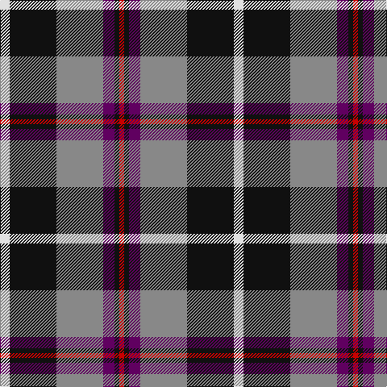

The parent of this is [Jewell of Kernow (Personal)](/tartans/ln/12/k58/n58/p14/k6/r/6/)

This was sourced from tartans-authority.  It is a [6 stripes tartan](/stripes/stripes6/).

Original link http://www.tartansauthority.com/tartan-ferret/display/7478/

## Thread count
LN/12 K58 N58 P14 K6 R/6

## Palette
Each colour and its ΔE from the base-6 reference it is a variant of.

| Colour | Shade | Base | ΔE (OKLab) |
|---|---|---|---|
| K |  `#101010` | K  | 0.17 |
| LN |  `#E0E0E0` | W  | 0.06 |
| N |  `#888888` | R  | 0.24 |
| P |  `#600060` | B  | 0.15 |
| R |  `#C80000` | R  | 0.00 |

# Sample pattern

ID: /variants/ln/12/k58/n58/p14/k6/r/6-k101010-lne0e0e0-n888888-p600060-rc80000/
