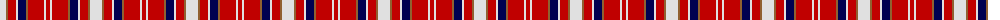

The parent of this is [Unidentified 34](/tartans/ln/12/lt2/r8/ln2/db8/lt2/r16/ln2/r/4/)

This was sourced from weddslist.  It is a [9 stripes tartan](/stripes/stripes9/).

Original link http://www.weddslist.com/cgi-bin/tartans/pg.pl?source=sts

## Thread count
LN/12 LT2 R8 LN2 DB8 LT2 R16 LN2 R/4

## Palette
Each colour and its ΔE from the base-6 reference it is a variant of.

| Colour | Shade | Base | ΔE (OKLab) |
|---|---|---|---|
| DB |  `#000050` | B  | 0.20 |
| LN |  `#E0E0E0` | W  | 0.06 |
| LT |  `#906030` | R  | 0.15 |
| R |  `#C00000` | R  | 0.02 |

ID: /variants/ln/12/lt2/r8/ln2/db8/lt2/r16/ln2/r/4-db000050-lne0e0e0-lt906030-rc00000/
