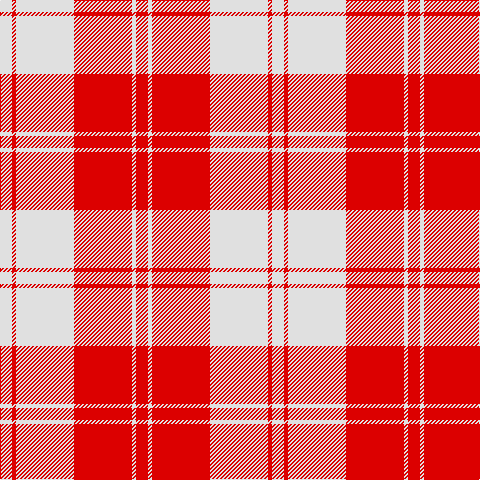

The parent of this is [Erskine (Red)](/tartans/ln/12/r4/ln58/r58/ln4/r/12/)

This was sourced from register-of-tartans.  It is a [6 stripes tartan](/stripes/stripes6/).

Original link https://www.tartanregister.gov.uk/tartanDetails.aspx?ref=1123

## Thread count
LN/12 R4 LN58 R58 LN4 R/12

## Palette
Each colour and its ΔE from the base-6 reference it is a variant of.

| Colour | Shade | Base | ΔE (OKLab) |
|---|---|---|---|
| LN |  `#E0E0E0` | W  | 0.06 |
| R |  `#DC0000` | R  | 0.04 |

# Sample pattern

ID: /variants/ln/12/r4/ln58/r58/ln4/r/12-lne0e0e0-rdc0000/
