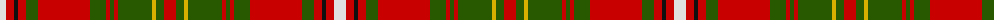

The parent of this is [Hay](/tartans/ln/12/r8/k4/r8/g12/r52/g16/r4/g4/r4/g34/y4/g8/r/12/)

This was sourced from register-of-tartans.  It is a [14 stripes tartan](/stripes/stripes14/).

Original link https://www.tartanregister.gov.uk/tartanDetails.aspx?ref=1631

## Thread count
LN/12 R8 K4 R8 G12 R52 G16 R4 G4 R4 G34 Y4 G8 R/12

## Palette
Each colour and its ΔE from the base-6 reference it is a variant of.

| Colour | Shade | Base | ΔE (OKLab) |
|---|---|---|---|
| G |  `#285800` | G  | 0.04 |
| K |  `#101010` | K  | 0.17 |
| LN |  `#E0E0E0` | W  | 0.06 |
| R |  `#C80000` | R  | 0.00 |
| Y |  `#D8B000` | Y  | 0.05 |

ID: /variants/ln/12/r8/k4/r8/g12/r52/g16/r4/g4/r4/g34/y4/g8/r/12-g285800-k101010-lne0e0e0-rc80000-yd8b000/
