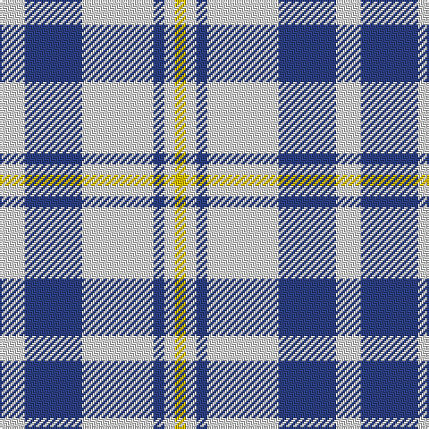

The parent of this is [Unidentified (Shirt)](/tartans/ln/14/b32/ln40/b6/ln6/y/6/)

This was sourced from register-of-tartans.  It is a [6 stripes tartan](/stripes/stripes6/).

Original link https://www.tartanregister.gov.uk/tartanDetails.aspx?ref=4272

## Thread count
LN/14 B32 LN40 B6 LN6 Y/6

## Palette
Each colour and its ΔE from the base-6 reference it is a variant of.

| Colour | Shade | Base | ΔE (OKLab) |
|---|---|---|---|
| B |  `#2C4084` | B  | 0.00 |
| LN |  `#E0E0E0` | W  | 0.06 |
| Y |  `#E8C000` | Y  | 0.00 |

# Sample pattern

ID: /variants/ln/14/b32/ln40/b6/ln6/y/6-b2c4084-lne0e0e0-ye8c000/
