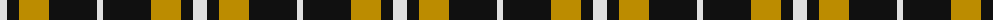

The parent of this is [Longford County, Crest Range](/tartans/ln/14/k12/dy30/k32/k16/ln/6/)

This was sourced from register-of-tartans.  It is a [6 stripes tartan](/stripes/stripes6/).

Original link https://www.tartanregister.gov.uk/tartanDetails.aspx?ref=5366

## Thread count
LN/14 K12 DY30 K32 K16 LN/6

## Palette
Each colour and its ΔE from the base-6 reference it is a variant of.

| Colour | Shade | Base | ΔE (OKLab) |
|---|---|---|---|
| DY |  `#BC8C00` | Y  | 0.16 |
| K |  `#101010` | K  | 0.17 |
| LN |  `#E0E0E0` | W  | 0.06 |

# Sample pattern

ID: /variants/ln/14/k12/dy30/k32/k16/ln/6-dybc8c00-k101010-lne0e0e0/
