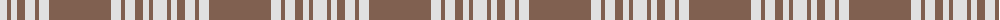

The parent of this is [Menzies, Brown & White](/tartans/ln/14/lt4/ln6/lt8/ln10/lt4/ln10/lt/62/)

This was sourced from weddslist.  It is a [8 stripes tartan](/stripes/stripes8/).

Original link http://www.weddslist.com/cgi-bin/tartans/pg.pl?source=sts

## Thread count
LN/14 LT4 LN6 LT8 LN10 LT4 LN10 LT/62

## Palette
Each colour and its ΔE from the base-6 reference it is a variant of.

| Colour | Shade | Base | ΔE (OKLab) |
|---|---|---|---|
| LN |  `#E0E0E0` | W  | 0.06 |
| LT |  `#806050` | R  | 0.17 |

# Sample pattern

ID: /variants/ln/14/lt4/ln6/lt8/ln10/lt4/ln10/lt/62-lne0e0e0-lt806050/
