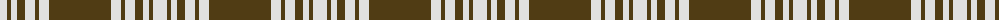

The parent of this is [Menzies Brown & White](/tartans/ln/14/t4/ln6/t8/ln10/t4/ln10/t/62/)

This was sourced from register-of-tartans.  It is a [8 stripes tartan](/stripes/stripes8/).

Original link https://www.tartanregister.gov.uk/tartanDetails.aspx?ref=2926

## Thread count
LN/14 T4 LN6 T8 LN10 T4 LN10 T/62

## Palette
Each colour and its ΔE from the base-6 reference it is a variant of.

| Colour | Shade | Base | ΔE (OKLab) |
|---|---|---|---|
| LN |  `#E0E0E0` | W  | 0.06 |
| T |  `#503C14` | G  | 0.15 |

# Sample pattern

ID: /variants/ln/14/t4/ln6/t8/ln10/t4/ln10/t/62-lne0e0e0-t503c14/
