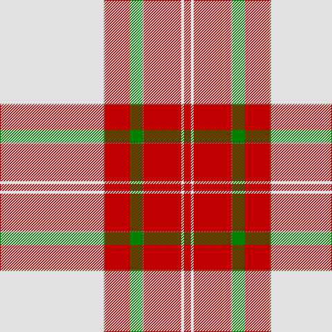

The parent of this is [Unidentified, Ross-shire](/tartans/ln/150/lt2/r36/g18/lt2/r54/ln4/r/10/)

This was sourced from weddslist.  It is a [8 stripes tartan](/stripes/stripes8/).

Original link http://www.weddslist.com/cgi-bin/tartans/pg.pl?source=sts

## Thread count
LN/150 LT2 R36 G18 LT2 R54 LN4 R/10

## Palette
Each colour and its ΔE from the base-6 reference it is a variant of.

| Colour | Shade | Base | ΔE (OKLab) |
|---|---|---|---|
| G |  `#008000` | G  | 0.09 |
| LN |  `#E0E0E0` | W  | 0.06 |
| LT |  `#806050` | R  | 0.17 |
| R |  `#C00000` | R  | 0.02 |

# Sample pattern

ID: /variants/ln/150/lt2/r36/g18/lt2/r54/ln4/r/10-g008000-lne0e0e0-lt806050-rc00000/
