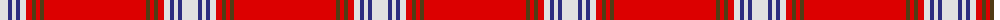

The parent of this is [Prince of Denmark](/tartans/ln/16/db4/ln4/db4/ln6/r6/t4/r4/t4/r/102/)

This was sourced from register-of-tartans.  It is a [10 stripes tartan](/stripes/stripes10/).

Original link https://www.tartanregister.gov.uk/tartanDetails.aspx?ref=3393

## Thread count
LN/16 DB4 LN4 DB4 LN6 R6 T4 R4 T4 R/102

## Palette
Each colour and its ΔE from the base-6 reference it is a variant of.

| Colour | Shade | Base | ΔE (OKLab) |
|---|---|---|---|
| DB |  `#2C2C80` | B  | 0.05 |
| LN |  `#E0E0E0` | W  | 0.06 |
| R |  `#DC0000` | R  | 0.04 |
| T |  `#503C14` | G  | 0.15 |

ID: /variants/ln/16/db4/ln4/db4/ln6/r6/t4/r4/t4/r/102-db2c2c80-lne0e0e0-rdc0000-t503c14/
