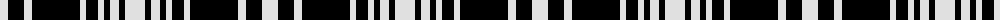

The parent of this is [MacLean, Black & White](/tartans/ln/16/k16/ln8/k48/ln6/k12/ln6/k6/ln9/k6/ln/20/)

This was sourced from weddslist.  It is a [11 stripes tartan](/stripes/stripes11/).

Original link http://www.weddslist.com/cgi-bin/tartans/pg.pl?source=sts

## Thread count
LN/16 K16 LN8 K48 LN6 K12 LN6 K6 LN9 K6 LN/20

## Palette
Each colour and its ΔE from the base-6 reference it is a variant of.

| Colour | Shade | Base | ΔE (OKLab) |
|---|---|---|---|
| K |  `#000000` | K  | 0.00 |
| LN |  `#E0E0E0` | W  | 0.06 |

ID: /variants/ln/16/k16/ln8/k48/ln6/k12/ln6/k6/ln9/k6/ln/20-k000000-lne0e0e0/
