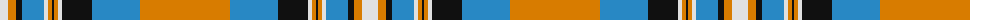

The parent of this is [MacGill of Jura (Clan?)](/tartans/ln/16/o8/k6/b22/ln4/o4/k2/o4/ln4/k30/ba48/o/90/)

This was sourced from tartans-authority.  It is a [12 stripes tartan](/stripes/stripes12/).

Original link http://www.tartansauthority.com/tartan-ferret/display/7733/

## Thread count
LN/16 O8 K6 B22 LN4 O4 K2 O4 LN4 K30 Ba48 O/90

## Palette
Each colour and its ΔE from the base-6 reference it is a variant of.

| Colour | Shade | Base | ΔE (OKLab) |
|---|---|---|---|
| B |  `#2888C4` | B  | 0.21 |
| Ba |  `#2888C4` | B  | 0.21 |
| K |  `#101010` | K  | 0.17 |
| LN |  `#E0E0E0` | W  | 0.06 |
| O |  `#D87C00` | Y  | 0.17 |

ID: /variants/ln/16/o8/k6/b22/ln4/o4/k2/o4/ln4/k30/ba48/o/90-b2888c4-ba2888c4-k101010-lne0e0e0-od87c00/
